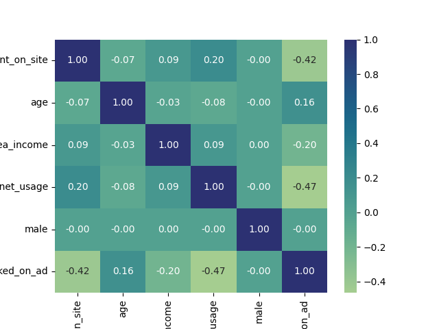

### 3.5 [Correlação](#35-correlacao)

Ao examinar atentamente a tabela de correlação e, subsequentemente, o mapa de calor (heatmap), acima, constata-se que não se evidenciam correlações substanciais entre os dados. No entanto, destacam-se correlações intrigantes entre as variáveis "clicked_on_ad" e "daily_time_spent_on_site" (Correlação: -0.423595), bem como "clicked_on_ad" e "daily_internet_usage"(Correlação: -0.467545), apresentando correlações negativas de natureza moderada.

Em termos práticos, isso implica que, em geral, **quanto mais tempo um usuário passa no site**, ou passa na internet diáriamente , **menor é a probabilidade de clicar no anúncio**. Como sempre, é necessário cautela na interpretação, pois **correlação não implica causalidade**, e outros fatores podem influenciar essa relação.

Deste modo, é possivel concluir que a análise correlacional proporciona insights preliminares relevantes sobre as interações entre as variáveis mencionadas, no entretanto, ressalta-se a necessidade imperativa de conduzir uma análise mais minuciosa e considerar o contexto específico do conjunto de dados para inferir conclusões precisas. Para isso iremos análisar as distribuição das variáveis indivudualmente