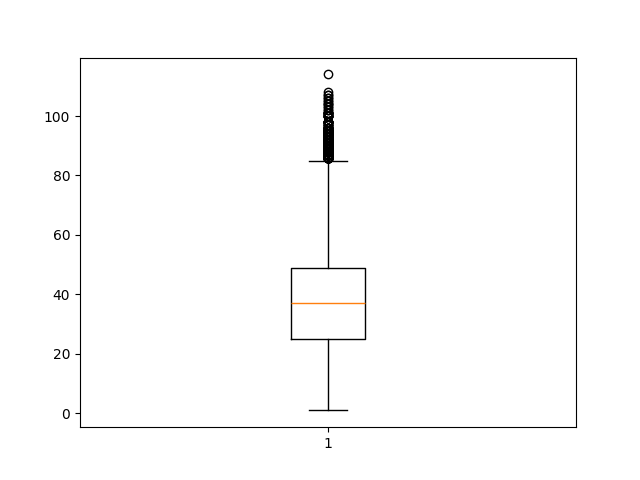

## 3. [Análise descritiva Exploratória (EDA)](#3-EDA) 
### 3.1 [Visualização dos dados](#32-Visualizacao-dos-dados)

A partir das informações obtidas pelas funções .info() e .shape, é possível verificar que a base de dados possui **10 atributos** e **101450 entradas**. Também observa-se a **ausência de nulos**, uma vez que todas as colunas possuem a mesma quantidade total de linhas.

Vamos explorar algumas estatísticas descritivas essenciais para cada variável.

- O tempo diário gasto no site apresenta uma média de aproximadamente 62,63 minutos, com uma variação considerável, evidenciada pelo desvio padrão de 27,05 minutos. No entanto, a presença de valores negativos e extremos, como -61,37 minutos, sugere a possibilidade de dados incorretos ou outliers.
  
- A idade média dos usuários é de cerca de 36,47 anos, com uma dispersão de 18,47 anos. Novamente, observamos a presença de valores negativos e extremos, como -51 anos, indicando a necessidade de uma revisão mais detalhada dos dados.

- A renda média da área é de USD 53.802,83, com um desvio padrão de USD 28.179,05. Valores negativos, como USD -64.296,67, podem apontar para erros nos dados, enquanto a amplitude de USD 177.414,25 destaca a variabilidade significativa na renda das áreas dos usuários.

- O uso diário da internet tem uma média de 173,06 minutos e uma ampla variação, indicada pelo desvio padrão de 72,85 minutos. No entanto, valores negativos, como -119,57 minutos, necessitam de investigação.

- A variável binária "Male" mostra uma distribuição quase equitativa, com uma média de 0,498, indicando uma divisão quase igual entre usuários masculinos e femininos.

- Por fim, a taxa de cliques em anúncios possui uma média de 0,599, sugerindo que cerca de 60% dos usuários clicaram em anúncios. No entanto, a presença de valores extremos e negativos destaca a importância de uma análise mais aprofundada para garantir a integridade dos dados.

Essas estatísticas descritivas oferecem uma **visão inicial dos dados**, destacando áreas potenciais para investigação adicional, correção de possíveis erros e preparação para análises mais avançadas.

### 3.2 [Análise de valores negativos](#32-analise-de-valores-negativos)

No que diz respeito às variáveis "Daily Time Spent on Site", "Age", "Area Income" e "Daily Internet Usage", foi observado que apresentam valores negativos, os quais carecem de sentido no contexto da base de dados. A abordagem adotada para lidar com essa questão consistiu na **remoção dos valores negativos**, uma vez que não é possível determinar se esses valores decorrem de erros de digitação ou coleta inadequada das informações.

Durante o processo de limpeza, retiramos cerca de **7,2%** do conjunto de dados. Sendo assim, a partir de agora, trabalhamos com um conjunto de dados que abrange **94.097** entradas distribuídas, ainda, em 10 colunas distintas.

### 3.3 [Análise de outliers](#33-analise-de-outliers)

A única variável que optamos por realizar a tratativa de outliers foi **'Age'**, com valor mínimo 0 e valor máximo 114. Não consideramos condizente aplicar dados de pessoas menores de 18 anos, e de acordo com cálculo **IQR** e concentração dos dados, optamos por fechar a amostra em 86 anos para melhor correlação com outras variáveis.

A quantidade de linhas retiradas foi 19830, que representa 19.55% do conjunto de dados.
(81620, 10).