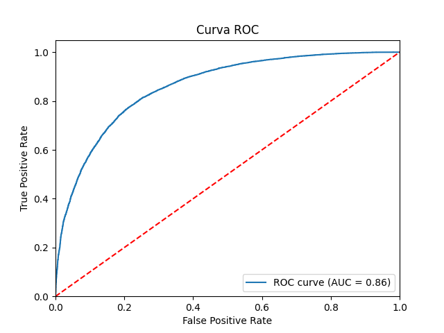

### 5.3 [Regressão Logística](#53-regressao-logistica)

Apesar das limitações relacionadas ao modelo de **regressão logística**, considerando o fato de não ser a escolha ideal para previsões em situações com um elevado número de outliers e baixa correlação entre as variáveis independentes.
Após realizar a análise da regressão logística, observamos que ele apresentou uma **precisão** de **0.81**, para casos **positivos** e **0.75** para casos **negativos**, superando outros modelos avaliados. Isso sugere que, mesmo diante das mencionadas desvantagens, a regressão logística demonstrou ser uma opção viável e competitiva para o problema em questão.

