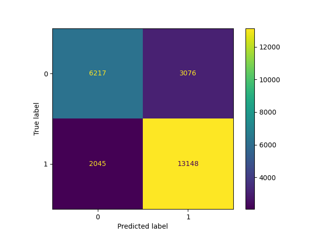

# :computer_mouse: Modelo Preditivo de Classificação de Cliques em Anúncios

## Descrição

Neste projeto, o objetivo é aplicar os conceitos aprendidos durante a nossa jornada na **Ada Tech** para desenvolver um modelo de aprendizado supervisionado, a fim de classificar um conjunto de dados de publicidade (*advertising*). Esse conjunto de dados indica se um usuário específico da internet clicou ou não em um anúncio de um site (não especificado nesta análise). Vamos elaborar um modelo que preveja se o usuário realizará o clique com base em suas características (*features*).

### Equipe

:small_blue_diamond: Camila - https://github.com/7cami

:small_blue_diamond: Gisele - https://github.com/xlSilva

:small_blue_diamond: Nathália - https://github.com/martinsnathalia

:small_blue_diamond: Sabrina - https://github.com/abyss-child

:small_blue_diamond: Stefhani - https://github.com/StefhaniAlkin
                 
**Programa:** Quero Ser Data Analytics

### Sumário

1. [Arquivos](#arquivos)
    
    1.1. [Bibliotecas utilizadas](#bibliotecas-utilizadas)

2. [Como executar](#como-executar)

3. [Introdução à base de dados](#introducao-a-base-de-dados)

4. [Pré-processamento e EDA](#pre-processamento-e-eda)

    4.1. [Visão inicial](#41-visao-inicial)

    4.2. [Análise de valores negativos](#42-analise-de-valores-negativos)

    4.3. [Análise de outliers](#43-analise-de-outliers)

    4.4. [Correlações](#44-correlacoes)

5. [Resultado: algoritmo de ML com melhor performance](#resultado)

## 1. [Arquivos](#arquivos)

Nosso repositório possui as cinco pastas principais a seguir.

* `0_Dados`: contém as bases de dados, em formato `CSV`, utilizadas no trabalho

* `1_Pre_Processamento`: contém os scripts de pré-processamento, que abrange a visualização inicial dos dados e tratativa de valores negativos

* `2_EDA`: contém os scripts com a **análise exploratória (EDA)**, que inclui tratativa de *outliers*, distribuição das variáveis numéricas e sua correlação

* `4_Modelagem`: contém os scripts relativos a separação dos dados em conjuntos de treino e de teste, execução dos algoritmos K Nearest Neighbours, Árvore de Decisão e Regressão Logística e otimização de hiperparâmetros do modelo com melhor performance

* `5_Imagens`: contém as imagens deste `README`

### 1.1. [Bibliotecas utilizadas](#bibliotecas-utilizadas)

```
import numpy as np
import pandas as pd
import matplotlib.pyplot as plt
import seaborn as sns
from wordcloud import WordCloud
from sklearn.model_selection import train_test_split
import warnings
warnings.filterwarnings('ignore')
from sklearn.preprocessing import MinMaxScaler
from sklearn.neighbors import KNeighborsClassifier
from sklearn.tree import DecisionTreeClassifier
from sklearn.linear_model import LogisticRegression
from sklearn.pipeline import Pipeline
from sklearn.metrics import f1_score, accuracy_score, precision_score, recall_score, roc_auc_score
from sklearn.metrics import confusion_matrix, ConfusionMatrixDisplay, classification_report
from sklearn.model_selection import StratifiedKFold, RandomizedSearchCV
from sklearn.linear_model import LogisticRegression
from sklearn.model_selection import cross_validate
from sklearn.metrics import roc_curve, auc
from scipy.stats import loguniform
```

## 2. [Como executar](#como-executar)

   * Para instalar as bibliotecas necessárias escreva, na linha de comando do terminal, o código:
   ```
   pip install -r requirements.txt
   ```
   * Para reproduzir este projeto via linha de comando, dentro da pasta principal do trabalho (Projeto_Final_ADA), basta escrever o comando `python` mais o nome da pasta  e do respectivo arquivo da seguinte forma: `python PASTA/NOME_DO_SCRIPT.py`. Por exemplo:
   ```
   python 1_Pre_Processamento/03_analise_outliers.py
   ```
   * Não há necessidade de estabelecer quaisquer parâmetros, pois os valores são configurados dentro de cada script. 

## 3. [Introdução à base de dados](#introducao-a-base-de-dados)

**Conjunto de dados de origem:** [advertising_full.csv](0_Dados/advertising_full.csv)

O conjunto fornecido contém dados relacionados à publicidade online, possivelmente para análise de comportamento do usuário ou modelagem preditiva. No que se refere a cada coluna, temos:

|Coluna | Descrição|
|-------|-----------|
|Daily Time Spent on Site| Variável contínua que representa a quantidade de tempo que um usuário passa no site diariamente|
|Age| Variável discreta (inteira) que representa a idade do usuário.|
|Area Income| Variável contínua que pode representar a renda média na área geográfica do usuário.|
|Daily Internet Usage| Variável contínua que representa a quantidade de tempo que um usuário passa na internet diariamente.|
|Ad Topic Line| Variável categórica (qualitativa nominal) que representa o tópico ou o título do anúncio.|
|City| Variável categórica (qualitativa nomial) que representa a cidade do usuário.|
|Male| Variável quantitativa discreta (binária; 0 ou 1) que indica o gênero do usuário.| Carrega uma informação qualitativa, em que o valor 1 corresponde ao gênero masculino e o 0, ao gênero feminino.|
|Country| Variável categórica (qualitativa nominal) que representa o país do usuário.|
|Timestamp| Variável quantitativa contínua (medida dentro de um intervalo de tempo), que representa quando o usuário interagiu com o anúncio.|
|Clicked on Ad| Variável quantitativa discreta (binária; 0 ou 1). Carrega uma informação qualitativa, em que o valor 1 indica que o usuário clicou no anúncio e o 0, que não clicou. Esta é a variável alvo em nosso problema de modelagem preditiva.|

## 4. [Pré-processamento e EDA](#pre-processamento-e-eda)

### 4.1. [Visão inicial](#41-visao-inicial)

A partir das informações obtidas pelas funções .info() e .shape, é possível verificar que a base de dados possui **10 atributos** e **101450 entradas**. Também observa-se a **ausência de valores nulos**, uma vez que todas as colunas possuem a mesma quantidade total de linhas.

Vamos explorar algumas estatísticas descritivas essenciais para cada variável.

- O **tempo diário gasto no site** apresenta uma **média** de aproximadamente 62,63 minutos, com uma variação considerável, evidenciada pelo **desvio padrão** de 27,05 minutos. No entanto, a presença de **valores negativos** e extremos, como -61,37 minutos, sugere a possibilidade de dados incorretos ou ***outliers***.
  
- Em relação à **idade** dos usuários, a **média** é de cerca de 36,47 anos, com **dispersão** de 18,47 anos. Novamente, observamos a presença de **valores negativos** e extremos, como -51 anos, indicando a necessidade de uma revisão mais detalhada dos dados.

- Quanto a **renda por área**, a **média** é de USD 53.802,83, com **desvio padrão** de USD 28.179,05. **Valores negativos**, como USD -64.296,67, podem apontar para erros nos dados, enquanto a **amplitude** de USD 177.414,25 destaca uma variabilidade significativa na renda por área dos usuários.

- O **uso diário da internet** tem uma **média** de 173,06 minutos e uma ampla variação, indicada pelo **desvio padrão** de 72,85 minutos. No entanto, **valores negativos**, como -119,57 minutos, necessitam de investigação.

- A variável binária **'Male'** mostra uma distribuição quase equitativa, com **média** de 0,498, indicando uma divisão quase igual entre usuários masculinos e femininos.

- Por fim, a **taxa de cliques** em anúncios possui uma **média** de 0,599, sugerindo que cerca de 60% dos usuários clicaram em anúncios. No entanto, a presença de **valores negativos** e extremos pede por uma análise mais aprofundada para garantir a integridade dos dados.

Essas estatísticas descritivas oferecem uma **visão inicial dos dados**, destacando áreas potenciais para investigação adicional, correção de possíveis erros e preparação para análises mais avançadas.

### 4.2. [Análise de valores negativos](#42-analise-de-valores-negativos)

No que diz respeito às variáveis **'Daily Time Spent on Site'**, **'Age'**, **'Area Income'** e **'Daily Internet Usage'**, foi observado que apresentam valores negativos, os quais carecem de sentido no contexto da base de dados. A abordagem adotada para lidar com essa questão consistiu na **remoção dos valores negativos**, uma vez que não é possível determinar se esses valores decorrem de erros de digitação ou coleta inadequada das informações.

Durante o processo de limpeza, retiramos cerca de **7,2%** do conjunto de dados,  restando ainda **94.097 entradas**.

### 4.3. [Análise de outliers](#43-analise-de-outliers)

Optamos por realizar a tratativa de *outliers* somente na variável **'Age'**, com valor mínimo 0 e valor máximo 114. Não consideramos condizente aplicar dados de pessoas menores de **18 anos**, e de acordo com cálculo **IQR** e concentração dos dados, decidimos fechar a amostra em **86 anos**, de modo a obter melhor correlação com outras variáveis.
<div align="center">
  
</div>

Após ambos os processos de tratamento, foi removido **19,55%** do conjunto de dados. Sendo assim, a partir de agora, trabalhamos com um conjunto de dados que abrange **81.620 entradas** distribuídas, ainda, em 10 colunas.

### 4.4. [Correlações](#44-correlacoes)
<div align="center">
  
</div>

Ao examinar a tabela de correlação e o mapa de calor (*heatmap*) acima, constata-se a ausência de correlações substanciais entre os dados. No entanto, destacam-se correlações negativas moderadas entre as variáveis **'clicked_on_ad'** e **'daily_time_spent_on_site'** (correlação **-0.423595**), bem como **'clicked_on_ad'** e **'daily_internet_usage'** (correlação **-0.467545**), bastante intrigantes.

Em termos práticos, isso implica que, em geral, **quanto mais tempo um usuário passa no site**, ou na internet diáriamente, **menor é a probabilidade de clicar no anúncio**. Como sempre, é necessário cautela na interpretação, pois **correlação não implica causalidade**, e outros fatores podem influenciar nessa relação.

Deste modo, é possivel concluir que a análise correlacional proporciona *insights* preliminares relevantes sobre as interações entre as variáveis mencionadas, entretanto, ressalta-se a necessidade imperativa de conduzir uma análise minuciosa e considerar o contexto específico do conjunto de dados para inferir resultados precisos. Para isso, analisaremos as distribuições das variáveis individualmente.

## 5. [Resultado: algoritmo de ML com melhor performance](#resultado)

<div align="center">
  
  
</div>

O modelo de **Regressão Logística** não é a escolha ideal para previsões em situações com elevado número de *outliers* e baixa correlação entre as variáveis independentes. Porém, em nossas análises, esse modelo apresentou **precisão** de **0,81** para casos **positivos** e de **0,75** para casos **negativos**, superando os demais modelos avaliados. Isso sugere que, mesmo diante das mencionadas desvantagens, a Regressão Logística demonstrou ser uma **opção viável e competitiva** para o problema em questão.