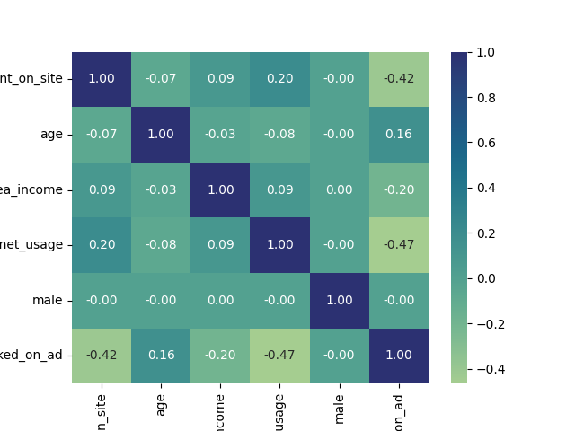

# :computer_mouse: **Modelo Preditivo de Classificação de Clique em Anúncios**


O objetivo deste projeto é aplicar os conceitos aprendidos durante a nossa jornada na **Ada** para desenvolver um modelo de aprendizado supervisionado, com a finalidade de classificar o conjunto de dados de publicidade(*advertising*). Este conjunto de dados indica se um usuário específico da *internet* clicou ou não em um anúncio de um site não especificado nesta análise. Vamos trabalhar para criar um modelo que preveja se o usuário realizará o clique com base em suas característica (*features*)


**Equipe** :
* Camila - https://github.com/7cami
* Gisele - https://github.com/xlSilva
* Nathália - https://github.com/martinsnathalia
* Sabrina - https://github.com/abyss-child
* Stefhani - https://github.com/StefhaniAlkin


**Linguagem de programação** : Python
**Como Executar**: para reproduzir este trabalho, basta executar o arquivo como python NOME_DO_SCRIPT.py em uma IDLE. Não há necessidade de estabelecer quaisquer parâmetros, pois os valores são setados dentro de cada script.
**Programa**: Quero Ser Data Analytics                                                                           
**Conjunto de dados de origem** : CSV - [Advertising.full](0_Dados\advertising_raw.csv)

**Índice**

1. [Introdução à base](#1-Introducao-a-base)

2. [Bibliotecas Utilizadas](#2-Bibliotecas-utilizadas)

3. [Análise descritiva Exploratória (EDA)](#3-EDA)

   3.1 [Visualização dos dados](#31-Visualizacao-dos-dados)

    3.2 [Análise de valores negativos](#32-analise-de-valores-negativos)

    3.3 [Análise de outliers](#33-analise-de-outliers)

    3.4 [Distribuição das variáveis numéricas](#34-distribuicao-das-variaveis-numericas)

    3.5 [Correlação](#35-correlacao)

4. [Separação dos conjuntos de treinamento e de teste](#4-treinamento-e-teste)

5.  [Modelagem de dados](#5-Modelagem-de-dados)

    5.1 [K Nearest Neighbors](#51-knearestneighbors)

    5.2 [Árvore de decisão](#52-arvore-de-decisao)

    5.3 [Regressão Logística](#53-regressao-logistica)

6. [Otimização do modelo (Regressão Logistica)](#6-otimizacao-do-modelo)


------------------------------------------

## 1. [Introdução à base](#1-Introducao-a-base)

A base de dados fornecida contém um conjunto de dados relacionado à publicidade online, possivelmente para análise de comportamento do usuário ou modelagem preditiva. No que se refere a cada coluna, temos: no que se refere a cada coluna, temos:

|Coluna | Descrição|
|-------|-----------|
|Daily Time Spent on Site| Variável contínua que representa a quantidade de tempo que um usuário passa no site diariamente|
|Age| Variável discreta (inteira) que representa a idade do usuário.|
|Area Income| Variável contínua que pode representar a renda média na área geográfica do usuário.|
|Daily Internet Usage| Variável contínua que representa a quantidade de tempo que um usuário passa na internet diariamente.|
|Ad Topic Line| Variável categórica (qualitativa nominal) que representa o tópico ou o título do anúncio.|
|City| Variável categórica (qualitativa nomial) que representa a cidade do usuário.|
|Male| Variável quantitativa discreta (binária; 0 ou 1) que indica o gênero do usuário.| Ela carrega consigo uma informação qualitativa, em que o valor 1 corresponde ao gênero masculino e 0 ao gênero feminino.|
|Country| Variável categórica (qualitativa nominal) que representa o país do usuário.|
|Timestamp| Variável quantitativa contínua (medida dentro de um intervalo de tempo), que representa quando o usuário interagiu com o anúncio.|
|Clicked on Ad| Variável quantitativa discreta (binária; 0 ou 1).Ela carrega consigo uma informação qualitativa, em que o valor 1 indica se o usuário clicou no anúncio e o 0 se não clicou. Esta é a variável alvo em nosso problema de modelagem preditiva.|

## 2. [Bibliotecas Utilizadas](#2-Bibliotecas-utilizadas)

```´
import numpy as np
import pandas as pd
import matplotlib.pyplot as plt
import seaborn as sns
from wordcloud import WordCloud
from sklearn.model_selection import train_test_split
import warnings
warnings.filterwarnings('ignore')
from sklearn.preprocessing import MinMaxScaler
from sklearn.neighbors import KNeighborsClassifier
from sklearn.tree import DecisionTreeClassifier
from sklearn.linear_model import LogisticRegression
from sklearn.pipeline import Pipeline
from sklearn.metrics import f1_score, accuracy_score, precision_score, recall_score, roc_auc_score
from sklearn.metrics import confusion_matrix, ConfusionMatrixDisplay, classification_report
from sklearn.model_selection import StratifiedKFold, RandomizedSearchCV
from sklearn.linear_model import LogisticRegression
from sklearn.model_selection import cross_validate
from sklearn.metrics import roc_curve, auc
from scipy.stats import loguniform
```

## 3. [Análise descritiva Exploratória (EDA)](#3-EDA) 
### 3.1 [Visualização dos dados](#31-Visualizacao-dos-dados)

A partir das informações obtidas pelas funções .info() e .shape, é possível verificar que a base de dados possui **10 atributos** e **101450 entradas**. Também observa-se a **ausência de nulos**, uma vez que todas as colunas possuem a mesma quantidade total de linhas.

Vamos explorar algumas estatísticas descritivas essenciais para cada variável.

- O tempo diário gasto no site apresenta uma média de aproximadamente 62,63 minutos, com uma variação considerável, evidenciada pelo desvio padrão de 27,05 minutos. No entanto, a presença de valores negativos e extremos, como -61,37 minutos, sugere a possibilidade de dados incorretos ou outliers.
  
- A idade média dos usuários é de cerca de 36,47 anos, com uma dispersão de 18,47 anos. Novamente, observamos a presença de valores negativos e extremos, como -51 anos, indicando a necessidade de uma revisão mais detalhada dos dados.

- A renda média da área é de USD 53.802,83, com um desvio padrão de USD 28.179,05. Valores negativos, como USD -64.296,67, podem apontar para erros nos dados, enquanto a amplitude de USD 177.414,25 destaca a variabilidade significativa na renda das áreas dos usuários.

- O uso diário da internet tem uma média de 173,06 minutos e uma ampla variação, indicada pelo desvio padrão de 72,85 minutos. No entanto, valores negativos, como -119,57 minutos, necessitam de investigação.

- A variável binária "Male" mostra uma distribuição quase equitativa, com uma média de 0,498, indicando uma divisão quase igual entre usuários masculinos e femininos.

- Por fim, a taxa de cliques em anúncios possui uma média de 0,599, sugerindo que cerca de 60% dos usuários clicaram em anúncios. No entanto, a presença de valores extremos e negativos destaca a importância de uma análise mais aprofundada para garantir a integridade dos dados.

Essas estatísticas descritivas oferecem uma **visão inicial dos dados**, destacando áreas potenciais para investigação adicional, correção de possíveis erros e preparação para análises mais avançadas.

### 3.2 [Análise de valores negativos](#32-analise-de-valores-negativos)

No que diz respeito às variáveis "Daily Time Spent on Site", "Age", "Area Income" e "Daily Internet Usage", foi observado que apresentam valores negativos, os quais carecem de sentido no contexto da base de dados. A abordagem adotada para lidar com essa questão consistiu na **remoção dos valores negativos**, uma vez que não é possível determinar se esses valores decorrem de erros de digitação ou coleta inadequada das informações.

Durante o processo de limpeza, retiramos cerca de **7,2%** do conjunto de dados. Sendo assim, a partir de agora, trabalhamos com um conjunto de dados que abrange **94.097** entradas distribuídas, ainda, em 10 colunas distintas.

### 3.3 [Análise de outliers](#33-analise-de-outliers)

A única variável que optamos por realizar a tratativa de outliers foi **'Age'**, com valor mínimo 0 e valor máximo 114. Não consideramos condizente aplicar dados de pessoas menores de 18 anos, e de acordo com cálculo **IQR** e concentração dos dados, optamos por fechar a amostra em 86 anos para melhor correlação com outras variáveis.


A quantidade de linhas retiradas foi 19830, que representa 19.55% do conjunto de dados.
(81620, 10).

### 3.5 [Correlação](#35-correlacao)



Ao examinar atentamente a tabela de correlação e, subsequentemente, o mapa de calor (heatmap), acima, constata-se que não se evidenciam correlações substanciais entre os dados. No entanto, destacam-se correlações intrigantes entre as variáveis "clicked_on_ad" e "daily_time_spent_on_site" (Correlação: -0.423595), bem como "clicked_on_ad" e "daily_internet_usage"(Correlação: -0.467545), apresentando correlações negativas de natureza moderada.

Em termos práticos, isso implica que, em geral, **quanto mais tempo um usuário passa no site**, ou passa na internet diáriamente , **menor é a probabilidade de clicar no anúncio**. Como sempre, é necessário cautela na interpretação, pois **correlação não implica causalidade**, e outros fatores podem influenciar essa relação.

Deste modo, é possivel concluir que a análise correlacional proporciona insights preliminares relevantes sobre as interações entre as variáveis mencionadas, no entretanto, ressalta-se a necessidade imperativa de conduzir uma análise mais minuciosa e considerar o contexto específico do conjunto de dados para inferir conclusões precisas. Para isso iremos análisar as distribuição das variáveis indivudualmente

### 5.3 [Regressão Logística](#53-regressao-logistica)


Apesar das limitações relacionadas ao modelo de **regressão logística**, considerando o fato de não ser a escolha ideal para previsões em situações com um elevado número de outliers e baixa correlação entre as variáveis independentes.
Após realizar a análise da regressão logística, observamos que ele apresentou uma **precisão** de **0.81**, para casos **positivos** e **0.75** para casos **negativos**, superando outros modelos avaliados. Isso sugere que, mesmo diante das mencionadas desvantagens, a regressão logística demonstrou ser uma opção viável e competitiva para o problema em questão.


